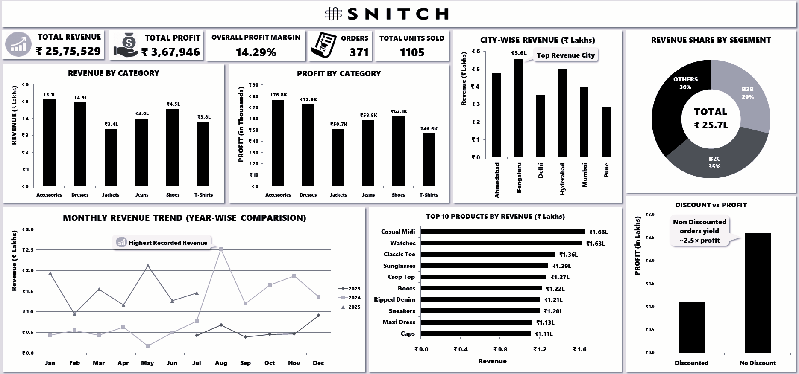

# 📊 Snitch Fashion Sales Analysis

## 📌 Project Summary
This project analyzes Snitch’s fashion sales data to evaluate **revenue performance, profitability, customer segments, product categories, city-wise contribution, and the impact of discounts**.  
The objective is to **identify key business insights** and **provide actionable recommendations to improve profitability and decision-making.**

---

## 🎯 Problem Statement
To analyze sales data and answer key business questions such as:
- Which categories and products generate the highest revenue and profit?
- Which cities contribute most to overall sales?
- How do discounts impact profitability?
- Which customer segment contributes the highest revenue?
- How does revenue trend over time?

---

## 🗂 Dataset Description

The dataset consists of **transactional sales records** with the following key attributes:

| Column Name        | Description |
|-------------------|-------------|
| **Order_ID**       | Unique identifier for each sale *(contains some duplicate values)* |
| **Customer_Name** | Name of the customer *(inconsistent formatting)* |
| **Product_Category** | Clothing category (e.g., T-Shirts, Jeans; includes typos and variations) |
| **Product_Name**  | Specific product sold |
| **Units_Sold**    | Quantity sold *(contains null and negative values)* |
| **Unit_Price**    | Price per unit *(some values missing or zero)* |
| **Discount_%**    | Discount applied *(some values exceed 100% or are missing)* |
| **Sales_Amount**  | Total revenue after discount *(some miscalculations present)* |
| **Order_Date**    | Date of order *(multiple formats or missing values)* |
| **City**          | Indian city *(inconsistent naming such as “Hyd”, “bengaluru”)* |
| **Segment**       | Market segment *(B2C, B2B, or missing)* |
| **Profit**        | Profit per sale *(contains unrealistic or negative values)* |

---

## 🛠 Tools & Technologies
- **Excel** – Data cleaning, Pivot Tables, Dashboard creation  
- **SQL** – Exploratory Data Analysis (EDA) and aggregations  

---

## 🔍 Methodology
1. Data understanding and validation  
2. Data cleaning (handling missing, invalid, and inconsistent values)  
3. Exploratory Data Analysis (EDA)  
4. KPI calculation (Revenue, Profit, Margin, Orders, Units Sold)  
5. Category-wise, city-wise, segment-wise, and time-based analysis  
6. Insight generation  
7. Dashboard creation  

---

## 📈 Key Insights
- Total revenue of **₹25.75 Lakhs** with a total profit of **₹3.67 Lakhs**, resulting in a **14.29% profit margin**.
- **Accessories and Dresses** are the most profitable product categories.
- **Jackets and T-Shirts** show comparatively lower profit contribution.
- **Bengaluru and Hyderabad** are the top revenue-generating cities, while **Pune** contributes the least.
- **B2C (35%) and Others (36%)** together account for over **70% of total revenue**.
- **Non-discounted orders generate approximately 2.5× higher profit** compared to discounted orders.
- Products such as **Casual Midi, Watches, and Classic Tee** are top revenue contributors.

---

## 📊 Dashboard Preview
This dashboard summarizes key sales KPIs, category performance, city-wise contribution, and the impact of discounts on profit.

---

## ✅ Conclusion & Recommendations
- Reduce excessive discounting to protect profit margins.
- Focus on high-margin categories such as Accessories and Dresses.
- Strengthen sales and marketing efforts in top-performing cities like Bengaluru and Hyderabad.
- Promote top-selling products with controlled discounts to maximize profitability.

---

## 🚀 Future Work
- Perform advanced analysis to measure customer lifetime value (CLV).
- Add predictive analysis to forecast sales and demand.
- Automate dashboards using Power BI / Tableau.
- Integrate real-time data sources for live reporting.
- Perform deeper discount optimization analysis.

---

## 👤 Author & Contact
**Abhijeet Singh**  
Data Analyst  
📧**Email:** singhabhijeet0503@gmail.com  
🔗[LinkedIn](https://www.linkedin.com/in/abhijeet-singh-591049395/)  
🔗[Github](https://github.com/AbhijeetS05)

📌 *This project demonstrates an end-to-end data analysis workflow, combining technical skills with business insight and visualization.*
